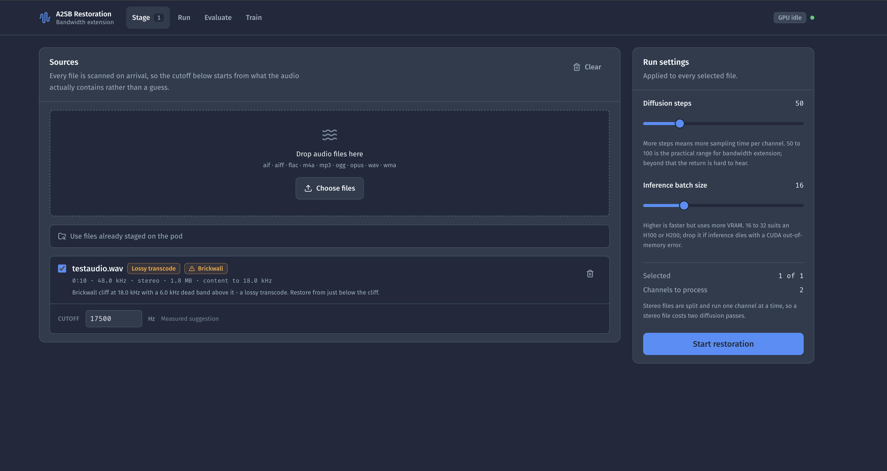
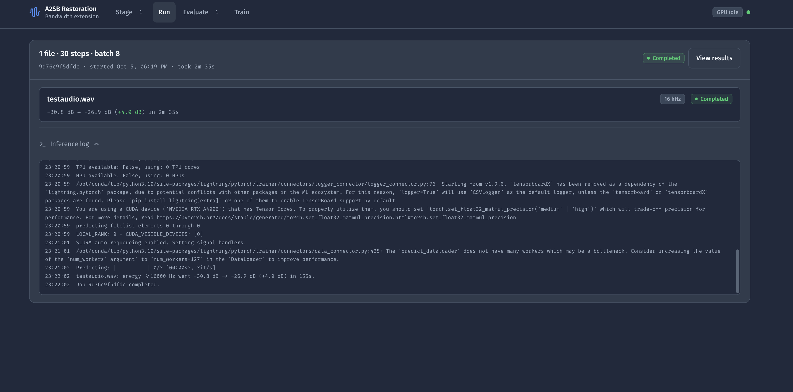
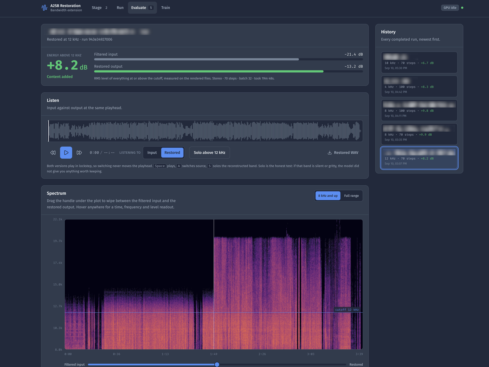
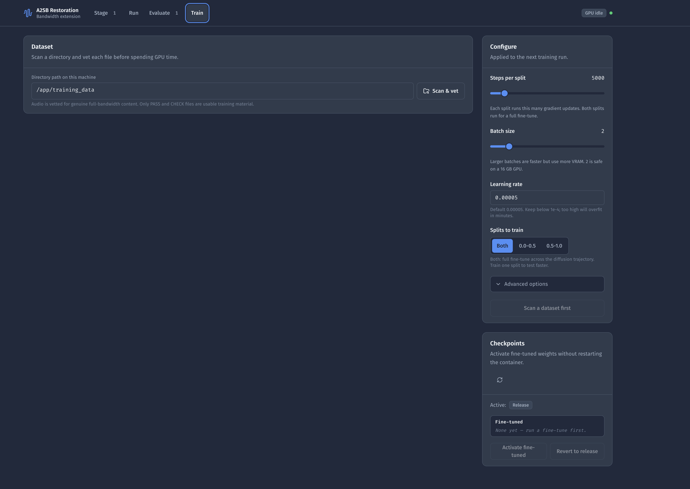

# A2SB Audio Restoration Wrapper


This repository provides a Dockerized interface for [NVIDIA's Audio-to-Audio Schrödinger Bridges (A2SB)](https://github.com/NVIDIA/diffusion-audio-restoration), a diffusion-based model for audio restoration and bandwidth extension. It wraps the upstream inference code in a FastAPI service and a React web app with stereo support, measured cutoff suggestions, live job progress, and A/B evaluation of the result.

## The interface

The app is organised around the three things you actually do, in order.

**Stage** — Drop files in, or point at a directory already on the pod. Each upload is stored under its own identifier; the original filename is a display label only, so two files named `same.wav` never overwrite one another. Every file is scanned on arrival and labelled with what it really contains: a *lossy transcode* with a brickwall cliff, a *genuine master* that fades naturally, or something already at *full bandwidth* with nothing to restore. The cutoff for each file is pre-filled from that measurement and stays editable, so the common case needs no decision and the unusual one is still under your control.



**Run** — Jobs go into a single-slot queue, because there is one GPU. Progress comes from the inference process itself: the diffusion sampler prints a per-step tqdm bar (not Lightning's one-item predict bar), a per-channel stage, and an ETA. Training progress uses the order of the splits you selected (a 0.5–1.0-only run starts at 0%, not 100%) and interpolates the displayed step from the resume offset. The log streams live and a run can be cancelled, which SIGTERMs the process group and then SIGKILLs any remaining children after a grace period. Live updates are server-sent events: log/progress events coalesce when a client falls behind, and a terminal job event is kept even if the queue is full. Job history survives a container restart; malformed `job.json` files are quarantined as `job.json.invalid` so one bad record cannot block startup. Anything that was mid-flight comes back marked *interrupted* rather than silently forgotten.



**Evaluate** — The headline number is how much energy the model actually added above the cutoff. Under it, an A/B transport plays the filtered input and the restored output from the same playhead, so switching never seeks. A *solo* control high-passes both so you hear only the reconstructed band; that path is applied even if you arm solo before the first play gesture, and it is fully bypassed (not left as 20 Hz high-pass stages) when solo is off. Two media elements are not sample-synchronous: the muted side is catch-up resynced if it drifts more than 20 ms, which is a listening comparison, not a sample-accurate A/B. That is the honest test: if the band is silent or gritty, the model did not give you anything worth keeping. An interactive spectrogram wipes between input and output with a draggable handle and reads out time, frequency, and level wherever you hover.



**Train** — Scan and vet a directory of high-quality audio directly in the UI, configure the fine-tune (additional steps, batch size, learning rate, which splits to train), and submit a training job into the same single-slot GPU queue. Each job writes to its own `runs/<job-id>/` folder; continuing an earlier run is an explicit **Resume from** choice. Progress streams live with per-split step counts, and loss curves are plotted inline as the run proceeds. TensorBoard is one click away when you want histograms or want to compare runs; it is proxied through this same port, so there is no second port to publish. When the run finishes, click **Activate fine-tuned** in the Checkpoints panel — the ensemble config is rewritten atomically without restarting the container. The next restoration job snapshots that config so both stereo channels use the same weights even if you activate again mid-job. Click **Revert to release** any time to go back.



## Features

- **Measured cutoff suggestions**: Each file's spectrum is scanned for a brickwall cliff. When one is found, the suggested cutoff sits just under it so the model regenerates from the last band that still has real signal. The same scan powers `training/vet_dataset.py`, so the UI and the dataset vetting tool always agree.
- **Real progress and cancellation**: The inference subprocess is streamed rather than buffered, so the progress bar tracks actual diffusion steps. Cancelling SIGTERMs the process group, then SIGKILLs remaining members after a grace period even if the parent already exited — a Lightning child that ignores SIGTERM cannot keep the GPU. SSE subscribers coalesce log/progress events when their queue is full so a completion update is not dropped. A malformed `job.json` is skipped on restart instead of blocking the whole history load.
- **Training metrics, two ways**: Loss curves are drawn in-app from Lightning's CSV log, and a full TensorBoard can be launched on demand and reverse-proxied through the app's port, so single-port deployments need no extra configuration.
- **Stereo support**: Splits left/right channels, runs A2SB per channel, recombines to stereo. Short spectrograms are padded to the exact diffusion window (an 87-frame clip becomes 256 frames, not 174). Inverse STFT requests the original sample count so the hop-sized tail is not dropped. Both channels read a job-start snapshot of the ensemble config, so activating different weights mid-file cannot mix checkpoints across L and R. A completely silent channel is copied through without diffusion so a hard-panned (or future M/S) file is not rejected as broken audio.
- **Numeric cutoff input**: Set the lowpass/restoration cutoff in **Hz** (1000–20000). Set it at or below where your source's content actually degrades — MP3 artifacts typically start between 10–16 kHz depending on bitrate. The value is passed directly to the model so the correct frequency mask is applied.
- **High-band energy readout**: After each restoration the app reports calibrated high-band RMS in **dBFS** (time-domain high-pass per channel, powers averaged so anti-phase/side content is not cancelled). Example: `energy ≥14000 Hz: −42.3 dBFS → −28.7 dBFS (+13.6 dB)`. Added high-band energy can be restoration or noise; it is not a quality score. When the model adds less than 1 dB, the result says so instead of presenting it as a success.
- **Linear-frequency spectrogram**: The comparison uses a linear-frequency STFT so the 14–22 kHz band occupies proportional vertical space. Levels are referenced to full scale (not each file's peak), so silence is dark and two panels stay comparable. Stereo uses the per-bin maximum across channels. Decode and STFT are capped (default 180 s, hop enlarged so the complex spectrogram stays near the display size) so hour-long files cannot allocate gigabytes.
- **Known-band contract**: The causal tenth-order low-pass changes phase and the transition band before inference, and the inverse STFT chain drops/adds the DC bin. The original lower band is therefore **not** bit-exact after restoration. That preprocessing is part of the pretrained weights; it is not changed here.
- **Headroom**: Model output is kept as float until export. Samples over ±1.0 are counted, then both stereo channels are scaled by the same peak (linked headroom) before 16-bit PCM write.
- **16-bit PCM output**: Restored WAVs are written as 16-bit PCM, matching the bit depth of typical CD/MP3 sources. Inverse STFT requests the original sample count so hop-misaligned tails are not dropped. Short spectrograms are padded to the full diffusion window before unfold.
- **Sample rate**: Input is resampled to **44.1 kHz** with soxr's high-quality band-limited sinc (`librosa.resample(..., res_type="soxr_hq")`) in float, then packed as 16-bit PCM. The `soxr` package is pinned in both Docker images. Linear interpolation (pydub's default) is not used: it aliases energy above the target Nyquist into the passband, so a 30 kHz tone at 96 kHz would otherwise appear as a 14.1 kHz tone the later low-pass cannot remove.
- **Output**: Restored WAVs are written per run under a bind-mounted directory (`restored_audio/` by default) with permissions fixed at container startup. Each file in a batch gets its own identifier directory under `runs/<job-id>/`, so identical filenames from different folders (or names that only differ by spaces vs underscores) cannot overwrite one another. Re-running with different settings also does not overwrite an earlier result.
- **Fine-tuned checkpoints**: GUI jobs write under `/app/outputs/training/runs/<job-id>/` and copy trained weights to `/app/outputs/training/checkpoints/` for activation. Activate in the Train tab; no extra mount is required.
- **GPU**: Uses a single NVIDIA GPU via Docker's GPU support. After loading the two split checkpoints, the unused construction-template network is dropped so Lightning does not keep a third copy on the accelerator.

## Prerequisites

- **Docker** and **Docker Compose**
- **NVIDIA GPU** with drivers and [NVIDIA Container Toolkit](https://docs.nvidia.com/datacenter/cloud-native/container-toolkit/install-guide.html) for CUDA in containers

## Installation and usage

1. **Clone the repository**:
   ```bash
   git clone https://github.com/semtex1987/A2SB-Upscaler-Docker
   cd A2SB-Upscaler-Docker
   ```

2. **Build and start the inference service**:
   ```bash
   docker compose up --build -d
   ```
   The first run can take several minutes while the image is built and NVIDIA checkpoints are downloaded. Later restarts reuse cached checkpoints; a dropped download cannot truncate a file that already succeeded.

3. **Open the UI**:  
   http://localhost:7860

4. **Restore audio**: Drop files on the **Stage** view, check the suggested cutoff for each one, and start the run. Watch it on **Run**, then compare input against output on **Evaluate**. Restored audio is saved under `restored_audio/runs/<job-id>/<file-id>/`.

## Development

The backend and frontend can run separately with hot reload. The API listens on 7860 and Vite proxies to it, so open the Vite URL rather than 7860.

```bash
# Terminal 1: the API, pointed at a local staging tree.
A2SB_INPUT_DIR=./dev/inputs A2SB_OUTPUT_DIR=./dev/outputs python3 app.py

# Terminal 2: the frontend.
cd web && npm install && npm run dev
```

Run the test suite from the repo root:

```bash
python3 -m pytest tests/ -q
```

The tests stub the diffusion step, so no GPU or checkpoint is needed. Pull requests run this suite plus `npm ci && npm run build` in `web/` (see `.github/workflows/build.yaml`). Pull requests run this pytest suite plus `npm run build` in `web/` via `.github/workflows/build.yaml`.

### Configuration

| Variable | Default | Purpose |
| --- | --- | --- |
| `A2SB_INPUT_DIR` | `/app/inputs` | Upload and staging tree. Paths outside it are refused. |
| `A2SB_OUTPUT_DIR` | `/app/outputs` | Restored audio and job history. |
| `A2SB_HOST` | `127.0.0.1` | Bind address. Local runs stay on loopback. Docker Compose sets `0.0.0.0` so published ports work. There is **no application authentication**; path confinement is not user authorization. Do not expose this port on a public network without an authenticated reverse proxy. |
| `A2SB_PUBLISH_HOST` | `127.0.0.1` | Host address Compose binds port 7860 to. Leave the default for local-only use. Set `0.0.0.0` only behind an authenticated reverse proxy or RunPod's HTTP proxy. |
| `A2SB_PORT` | `7860` | Listen port. |
| `A2SB_INFERENCE_CWD` | `/app/inference` | Where `A2SB_upsample_api.py` lives. |
| `A2SB_WEB_DIR` | `/app/web` | Built frontend. Falls back to `web/dist` for local runs. |
| `A2SB_DEFAULT_BATCH_SIZE` | `16` | Starting batch size; lower it if inference hits CUDA OOM. |

## Sample Docker Compose
```yaml
services:
  upsampler:
    build: .
    image: semtex87/a2sb-upscaler
    container_name: nvidia_upsample

    ports:
      - "${A2SB_PUBLISH_HOST:-127.0.0.1}:7860:7860"

    volumes:
      - ./restored_audio:/app/outputs
      - ./training_data:/app/training_data

    environment:
      - PYTORCH_CUDA_ALLOC_CONF=max_split_size_mb:512
      - A2SB_HOST=0.0.0.0

    healthcheck:
      test: ["CMD", "python3", "-c", "import urllib.request; urllib.request.urlopen('http://127.0.0.1:7860/healthz', timeout=5)"]
      # The entrypoint downloads missing checkpoints (cached files are kept;
      # a failed wget cannot truncate a previously good file) before the server binds.
      start_period: 20m
      interval: 30s
      timeout: 10s
      retries: 3

    # Let a running job be cancelled cleanly before Docker sends SIGKILL.
    stop_grace_period: 30s

    deploy:
      resources:
        reservations:
          devices:
            - driver: nvidia
              device_ids: ['0']
              capabilities: [gpu]

    stdin_open: true
    tty: true
```

## Output and volumes

- **Restored files**: The `restored_audio/` directory (bind-mounted to `/app/outputs` in the container) receives all restored WAVs, one directory per run under `runs/<job-id>/`, and one identifier subdirectory per file so equal basenames never share an output. Job metadata alongside them makes history survive a restart. The entrypoint fixes ownership so the app user can write there.
- **Optional fine-tuned checkpoints**: GUI and CLI training export weights to `<training-output>/checkpoints/` (inside the container that is `/app/outputs/training/checkpoints`, which is already on the `./restored_audio` volume). **Activate fine-tuned** and the entrypoint read that same directory. To load weights from a different tree, set `A2SB_FINETUNED_CKPT_DIR` and mount it there:
  ```yaml
  volumes:
    - ./restored_audio:/app/outputs
    - ./my_finetuned:/app/ckpts/finetuned:ro
  environment:
    - A2SB_FINETUNED_CKPT_DIR=/app/ckpts/finetuned
  ```

## Fine-tuning the model

You can fine-tune the two A2SB split checkpoints on your own high-quality, full-bandwidth audio to improve restoration beyond the release checkpoints' ~12 kHz ceiling.

### Option A — via the Train tab (recommended)

The **Train** tab runs fine-tuning inside the same container as inference, so no second container or separate compose file is needed.

1. **Mount training data**: Add your high-quality audio to `./training_data/` (bind-mounted to `/app/training_data`). WAV and FLAC work best; 44.1 kHz is ideal.

2. **Scan & vet**: On the Train tab, enter the directory path and click **Scan & vet**. Each file is spectral-scanned with the same algorithm as `training/vet_dataset.py`, then gated with the **same** `estimated_true_sr >= 32000` rule the training loader uses (`apply_sr_loss_mask`). Verdicts are **heuristics** from the first two minutes of audio — they cannot prove a file's provenance. Duration is read from the file header, not that decode window. Editing the path clears a previous scan; submit only after a matching Scan & vet. Preflight errors return `{problems: [...]}` and the Train tab shows those strings directly.
   - **PASS** — real energy to ≥20.5 kHz *and* the trainer would keep the file
   - **CHECK** — 17–20.5 kHz; may be a dark master or a 320 kbps transcode; listen before including
   - **REJECT** — below 17 kHz, or the trainer-gate estimate is under 32 kHz (16 kHz of real bandwidth). Training on these teaches the model to output silence in the high band, or the loader would drop them anyway.

3. **Configure and start**: Set **additional** steps, batch size, learning rate, and which splits to train (both by default). Each job gets its own output folder under `/app/outputs/training/runs/<job-id>/`, so a second job will not silently continue the previous checkpoint. To continue a run, choose it under **Resume from** — additional steps are added to that checkpoint's `global_step`. Then click **Start fine-tuning**. A preflight check verifies disk space (~25 GB needed), release checkpoints, and framework availability. Training queues behind any active restoration job, and the header GPU badge reads "Training" so you know not to wait on restorations.

4. **Watch it train**: The **Loss curves** panel plots train and validation loss per split, straight from Lightning's `metrics.csv`, refreshing every 10 seconds while the run is live. Hover for the value at any step, and switch to a log axis when the curve flattens out.

   For anything deeper — histograms, distributions, comparing runs — click **Launch TensorBoard**. It starts on demand, takes 15–30 seconds to scan the log tree, then appears inline. **New tab** opens it full-screen, and **Stop** shuts the process down.

   TensorBoard is reverse-proxied at `/tensorboard/` through the app's own port, so nothing extra needs publishing — this works unchanged on RunPod and behind a single mapped port. There is no separate 6006 to expose.

5. **Activate**: When training completes, click **Activate fine-tuned** in the Checkpoints panel. The ensemble config is rewritten atomically (temp file + rename) — no container restart. Restoration jobs snapshot that file when they **start**, so Left and Right cannot pick up different weights if you activate again while a stereo file is running. The pinned checkpoint list is stored on the job record. Click **Revert to release** to go back at any time.

### Option B — via the CLI / separate training container

For long runs, automated pipelines, or when the main container is busy, use the separate training container:

```bash
# Vet your dataset
docker compose -f training/docker-compose.train.yml run trainer \
    python /app/training/vet_dataset.py /data/training_data

# Fine-tune
docker compose -f training/docker-compose.train.yml run trainer \
    python /app/training/finetune.py --steps 5000
```

Checkpoints land in `training_output/checkpoints/`. Copy them into `restored_audio/training/checkpoints/` (the GUI export path) and click **Activate**, or mount that tree and set `A2SB_FINETUNED_CKPT_DIR`:

```yaml
volumes:
  - ./restored_audio:/app/outputs
  - ./training_output/checkpoints:/app/ckpts/finetuned:ro
environment:
  - A2SB_FINETUNED_CKPT_DIR=/app/ckpts/finetuned
```

For more CLI options (`--splits`, `--batch-size`, `--learning-rate`, data quality guidance) see **[training/README.md](training/README.md)**.
## RunPod and other cloud GPU pods

Pre-configured template https://console.runpod.io/deploy?template=rtpczbd3cl&ref=685x2sbd

When you run this app on RunPod (or similar), use the image **as built from this repo** and configure the Pod so the app can write outputs and the inference subprocess can run.

### Use this repo’s image and entrypoint

1. **Use this project’s image as the template Container Image**  
   Build from this repo’s `Dockerfile`, push to Docker Hub (or your registry), and set that image as the **Container Image** in your RunPod template. Do **not** use RunPod’s “application only” pattern that clears the entrypoint (e.g. `ENTRYPOINT []` and `CMD ["python", "/app/app.py"]`). This image’s **ENTRYPOINT** runs a script that fixes permissions for `/app/inputs`, `/app/outputs`, and `/debug` before starting the app; if you override it, you can get “A2SB inference produced no output file” or permission errors.

2. **Expose the web port behind authentication**  
   In the template's **HTTP Ports**, add port **7860**. Use that URL to open the UI once the Pod is running. The app streams job progress over server-sent events; RunPod's proxy passes these through, and the server sends keepalives so idle streams are not closed. The API has **no login**. Treat the pod URL as privileged: anyone who can reach it can submit jobs, train, activate checkpoints, and read media under the allowed roots. Prefer RunPod's own auth / an authenticated reverse proxy; do not publish 7860 on the public internet unprotected. Set `A2SB_HOST=0.0.0.0` in the container so the proxy can connect (Compose already does this).

3. **Mount a volume to `/app/outputs`**  
   The app and the inference subprocess write restored WAVs to `/app/outputs`. In RunPod, add a **Volume** to the Pod and mount it at **Container path** `/app/outputs`. If this directory isn’t writable (e.g. no volume or wrong path), inference can complete without writing a file and you’ll see “A2SB inference produced no output file.”

4. **Container disk**  
   The image includes large checkpoints; set **Container Disk** to at least **20 GB** (or more if you add fine-tuned checkpoints).

5. **Optional**  
   Mount a volume at `/app/inputs` if you want uploaded files to persist across restarts.

### If you extend a RunPod base image instead

If you build a custom template by extending a RunPod base image (e.g. `runpod/pytorch:...`) and copy this app into it, keep this app’s entrypoint so permissions are fixed. For example, end your Dockerfile with:

```dockerfile
COPY entrypoint.sh /app/entrypoint.sh
RUN chmod +x /app/entrypoint.sh
ENTRYPOINT ["/app/entrypoint.sh"]
CMD ["python3", "/app/app.py"]
```

Do **not** use `ENTRYPOINT []` and `CMD ["python", "/app/app.py"]` only, or the inference subprocess may fail on `/debug` or `/app/outputs`.

### Local Docker run (for comparison)

```bash
docker run -it --gpus all -p 127.0.0.1:7860:7860 \
  -e A2SB_HOST=0.0.0.0 \
  -v /path/on/host/outputs:/app/outputs \
  -v /path/on/host/inputs:/app/inputs \
  your-image-name
```

Binding the *host* publish to `127.0.0.1` keeps the UI local. `A2SB_HOST=0.0.0.0` is required inside the container so Docker's port mapping can reach the process. For a public/pod URL, put an authenticated reverse proxy in front; this app does not implement users or API keys.

## Troubleshooting

- **Permission denied on outputs or `/debug`**: The image entrypoint runs as root, fixes ownership on `/app/inputs`, `/app/outputs`, and `/debug`, then drops to the app user. Rebuild the image so the updated entrypoint and `/debug` creation are included.
- **Restored audio sounds wrong or only up to ~12 kHz**: The release checkpoints were trained on data with limited high-frequency content. Use the fine-tuning pipeline with full-bandwidth material and the optional checkpoint mount to improve high-end extension. Set the cutoff at or below where your source content actually degrades, then use **Solo** on the Evaluate view to listen to the reconstructed band on its own.
- **The UI loads but says the frontend bundle is missing**: The image builds the frontend in a separate stage. If you are running outside Docker, run `npm ci && npm run build` in `web/`, or set `A2SB_WEB_DIR` to a directory containing `index.html`.
- **“No output file” / inference fails**: Usually the inference subprocess failed earlier (e.g. Permission denied on `/debug` or `/app/outputs`). Check the container logs for the Python traceback just above this message. Mount a writable volume to `/app/outputs` and ensure the image entrypoint is used.
- **vGPU / “Operation not supported”**: Prefer PCIe passthrough for the GPU if possible; otherwise ensure Docker and the NVIDIA stack are configured for your vGPU environment.
- **Port in use**: Change the host port in `docker-compose.yml` (e.g. `"127.0.0.1:8080:7860"`).

## Credits

- **Upstream**: [NVIDIA diffusion-audio-restoration](https://github.com/NVIDIA/diffusion-audio-restoration) and the paper [Audio-to-Audio Schrödinger Bridges](https://arxiv.org/abs/2305.15083).
- This wrapper adds the FastAPI service and React interface, the job queue with live progress and cancellation, measured cutoff suggestions, A/B evaluation with high-band solo, stereo handling, 16-bit PCM output, high-band energy readout, linear-frequency STFT comparison, 44.1 kHz normalization, bind-mount permission handling, optional fine-tuned checkpoint loading, training automation under `training/`, and the dataset vetting utility.
